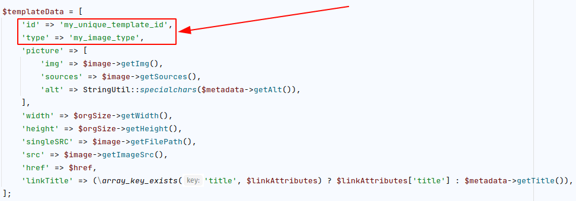

# Responsive Image Styling Bundle


- [German](#Beschreibung)
- [English](#Description)

---

## Beschreibung

Ziel des Bundles ist es die [kumulative Layout-Verschiebung](https://web.dev/cls/), welche beim Laden der Bilder entsteht zu verhindern.

Dies wird ermöglicht, indem für jedes Bild bzw. dem dazugehörigen Image-Container ein CSS-Snippet hinzugefügt wird.
Das Styling enthält ein `:before` Element mit der richtigen **Proportion** als `padding-top`, welches für jeden konfigurierten Media Query der Bildgrößen aus der Breite und der Höhe errechnet wird.

Um eindeutige Style-Angaben generieren zu können, wird die **ID des dazugehörigen Elements** in das Styling mitaufgenommen.

```css
@media only screen and (min-width:768px) {
    .image_container_xxx_element_type::before {
        padding-top: 74.29%
    }
    .image_container_xxx_element_type {
        width: 385px
    }
}
@media only screen and (max-width:767px) {
    .image_container_xxx_element_type::before {
        padding-top: 74.24%
    }
    .image_container_xxx_element_type {
        width: 295px
    }
}
```

---

### CSS Styling

Folgendes CSS-Styling muss manuell integriert werden.

Das Bundle kümmert sich nur um das Hinzufügen der richtigen Proportionen. Für die richtige Ausgabe muss das eigene Styling angepasst werden.

```css
.image_container {
	display: block;
	position: relative;
	max-width: 100%;
}

.image_container::before {
	content:  "";
	display: block;
}

.image_container img {
	width: 100%;
	height: auto;
	display: block;
	position: absolute;
	top: 0;
	left: 0;
}
```

---

### Template

Das Bundle fügt automatisch einige Klassen zum Standard `figure` hinzu.

```html
<!-- Contao Standard -->
<figure class="image_container">

<!-- Weitere Klassen wurden hinzugefügt -->
<figure class="image_container image_container_350_element_type image_container_jpg">
```

---

### Lazy Loading

Das Nachladen der Bilder kann via HTML Attribut `loading="lazy"` oder aber über eine JS-Library umgesetzt werden. Hierzu ein [Blogpost von Google](https://web.dev/lazy-loading-images/ "Hierzu ein Blogpost von Google").

---

### Bildgrößen / Responsive Images

Diese Funktionalität bietet Contao bereits seit langer Zeit und wurde auch stetig erweitert und verbessert.

Von @ausi wurde hierzu ein sehr guter Artikel geschrieben:
[Responsive Images und das Picture Element in Contao verwenden](https://rocksolidthemes.com/de/contao/blog/responsive-images-picture-contao "Responsive Images und das Picture Element in Contao verwenden")

Seit [Conato 4.8.0](https://contao.org/de/news/contao_4-8-0.html "Conato 4.8.0") können Bildgrößen auch über eine .yml Datei konfiguriert werden.
[Contao Dokumentation - image-sizes](https://docs.contao.org/dev/framework/image-processing/image-sizes/ "Contao Dokumentation")

---

### Verwendung mit RockSolid Custom Element

Code-Snippet um die Ausgabe von Bildern über die Contao Templates laufen zu lassen und somit die Funktionen des Bundles zu verwenden.

```php
// Prepare some data for the image creation
$imgSrc = $this->singleSRC;
$imgSizes = $this->size;
$imgAttributes = [
    'fullsize' => true,
    'alt' => 'alternative text'
];

// Generate an image object with the getImageObject function provided by the bundle
$image = $this->getImageObject($imgSrc, $imgSizes, null, null, $imgAttributes);
if (null !== $image) {
    // Extending the image object with some additional information
    $image->type = 'element_type';
    
    // Converting the \stdClass object to an associative array
    try {
        $imgData = json_decode(json_encode($image, JSON_THROW_ON_ERROR), true, 512, JSON_THROW_ON_ERROR)
    } catch (\JsonException $exception) {
        $imgData = null;
    }
    
    // Inserting the image into the template
    if (null !== $imgData) {
        $this->insert('image', $imgData);
    }
}
```

---

### Tipps und Tricks

Damit die Logik des Bundles greifen kann, muss das image- oder gallery-Template eine ID besitzen.
Diese wird benötigt, um ein eindeutiges Styling zu generieren.

Ist die ID nicht vorhanden, wird kein eigenes Styling erstellt und kein Placeholder ist vorhanden.
Wird für den ``-Tag keine eigene Breite/Höhe verwendet, kann es sein, dass das Bild dann nicht angezeigt wird.



```php
$figure = $this->studio
    ->createFigureBuilder()
    ->from($singleSRC)
    ->setSize($size)
    ->setMetadata($metadata)
    ->buildIfResourceExists()
;

if (null === $figure) {
    return null;
}

$image = $figure->getImage();
$orgSize = $image->getOriginalDimensions()->getSize();
$metadata = $figure->hasMetadata() ? $figure->getMetadata() : new Metadata([]);
$linkAttributes = $figure->getLinkAttributes();
$href = $figure->getLinkHref();

$templateData = [
    'id' => 'my_unique_template_id',
    'type' => 'my_image_type',
    'picture' => [
        'img' => $image->getImg(),
        'sources' => $image->getSources(),
        'alt' => StringUtil::specialchars($metadata->getAlt()),
    ],
    'width' => $orgSize->getWidth(),
    'height' => $orgSize->getHeight(),
    'singleSRC' => $image->getFilePath(),
    'src' => $image->getImageSrc(),
    'href' => $href,
    'linkTitle' => (\array_key_exists('title', $linkAttributes) ? $linkAttributes['title'] : $metadata->getTitle()),
];
```

---
---
---

## Description

The aim of the bundle is to prevent the [cumulative layout shift](https://web.dev/cls/) that occurs when loading the images.

This is made possible by adding a CSS snippet for each image or its image container. The styling contains a `:before` element with the correct **proportion** as `padding-top`, which is calculated for each configured media query of the image sizes from the width and the height.

To be able to generate unique style information, the **ID of the associated element** is included in the styling.

```css
@media only screen and (min-width:768px) {
    .image_container_xxx_element_type::before {
        padding-top: 74.29%
    }
    .image_container_xxx_element_type {
        width: 385px
    }
}
@media only screen and (max-width:767px) {
    .image_container_xxx_element_type::before {
        padding-top: 74.24%
    }
    .image_container_xxx_element_type {
        width: 295px
    }
}
```

---

### CSS Styling

The following CSS styling must be integrated manually.

The bundle only takes care of adding the correct proportions. Custom styling must be adjusted for proper output.

```css
.image_container {
	display: block;
	position: relative;
	max-width: 100%;
}

.image_container::before {
	content:  "";
	display: block;
}

.image_container img {
	width: 100%;
	height: auto;
	display: block;
	position: absolute;
	top: 0;
	left: 0;
}
```

---

### Template

The bundle automatically adds some classes to the default `figure`.

```html
<!-- Contao standard -->
<figure class="image_container">

<!-- More classes were added -->
<figure class="image_container image_container_350_element_type image_container_jpg">
```

---

### Lazy Loading

The reloading of the images can be implemented via HTML attribute `loading="lazy"` or via a JS library. Here is a [blog post from Google](https://web.dev/lazy-loading-images/ "Hierzu ein Blogpost von Google").

---

### Responsive Images

This functionality has been offered by Contao for a long time and has been continuously extended and improved.

@ausi wrote a very good article about this: 
[Responsive Images und das Picture Element in Contao verwenden](https://rocksolidthemes.com/de/contao/blog/responsive-images-picture-contao "Responsive Images und das Picture Element in Contao verwenden").

Since [Conato 4.8.0](https://contao.org/de/news/contao_4-8-0.html "Conato 4.8.0"), image sizes can also be configured via a .yml file. 
[Contao documentation - image-sizes](https://docs.contao.org/dev/framework/image-processing/image-sizes/ "Contao Dokumentation")

---

### Usage with RockSolid Custom Element

Code snippet to run the output of images via the Contao templates and thus use the functions of the bundle.

```php
// Prepare some data for the image creation
$imgSrc = $this->singleSRC;
$imgSizes = $this->size;
$imgAttributes = [
    'fullsize' => true,
    'alt' => 'alternative text'
];

// Generate an image object with the getImageObject function provided by the bundle
$image = $this->getImageObject($imgSrc, $imgSizes, null, null, $imgAttributes);
if (null !== $image) {
    // Extending the image object with some additional information
    $image->type = 'element_type';
    
    // Converting the \stdClass object to an associative array
    try {
        $imgData = json_decode(json_encode($image, JSON_THROW_ON_ERROR), true, 512, JSON_THROW_ON_ERROR)
    } catch (\JsonException $exception) {
        $imgData = null;
    }
    
    // Inserting the image into the template
    if (null !== $imgData) {
        $this->insert('image', $imgData);
    }
}
```

---

### Tips and tricks

For the logic of the bundle to work, the image or gallery template must have an ID. 
This is needed to generate a unique styling.

If the ID is not present, no custom styling is created and no placeholder is present. 
If no custom width/height is used for the `` tag, the image may not be displayed then.


```php
$figure = $this->studio
    ->createFigureBuilder()
    ->from($singleSRC)
    ->setSize($size)
    ->setMetadata($metadata)
    ->buildIfResourceExists()
;

if (null === $figure) {
    return null;
}

$image = $figure->getImage();
$orgSize = $image->getOriginalDimensions()->getSize();
$metadata = $figure->hasMetadata() ? $figure->getMetadata() : new Metadata([]);
$linkAttributes = $figure->getLinkAttributes();
$href = $figure->getLinkHref();

$templateData = [
    'id' => 'my_unique_template_id',
    'type' => 'my_image_type',
    'picture' => [
        'img' => $image->getImg(),
        'sources' => $image->getSources(),
        'alt' => StringUtil::specialchars($metadata->getAlt()),
    ],
    'width' => $orgSize->getWidth(),
    'height' => $orgSize->getHeight(),
    'singleSRC' => $image->getFilePath(),
    'src' => $image->getImageSrc(),
    'href' => $href,
    'linkTitle' => (\array_key_exists('title', $linkAttributes) ? $linkAttributes['title'] : $metadata->getTitle()),
];
```
